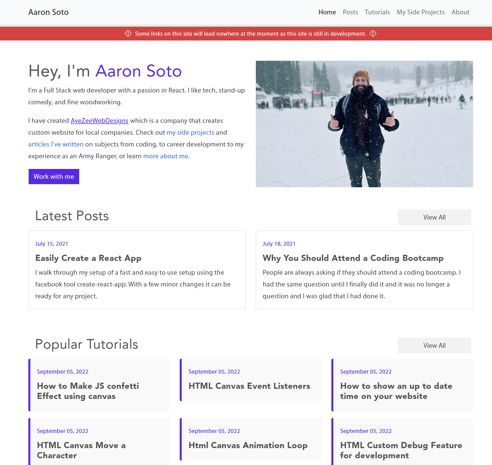

# My Portfolio

## Description

This is my corner of the interent where I will keep all my thoughts, tutorials, projects or anything else at.

---

## Table of Contents

- [Links](#links)
- [Credits](#credits)
- [Badges](#badges)
- [How to Contribute](#How_to_contribute)

## Links

- [Demo Link](https://aaronsoto.io)
- [Code Link](https://github.com/final-portfolio)

## Credits

This project has only been worked on by myself at the moment. Maybe your name can be added here one day?

---

## Badges

## How to Contribute

